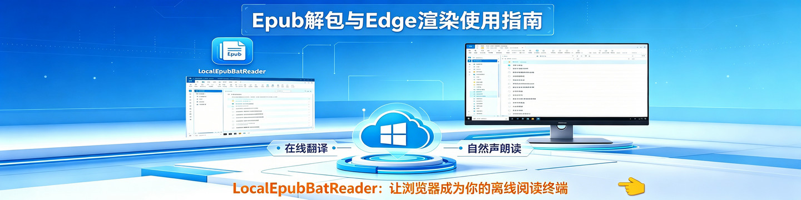
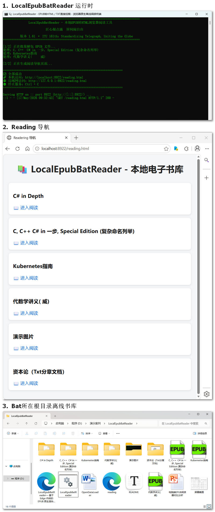
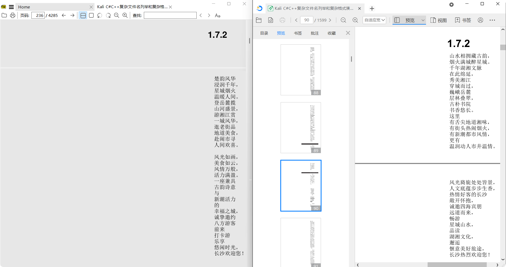
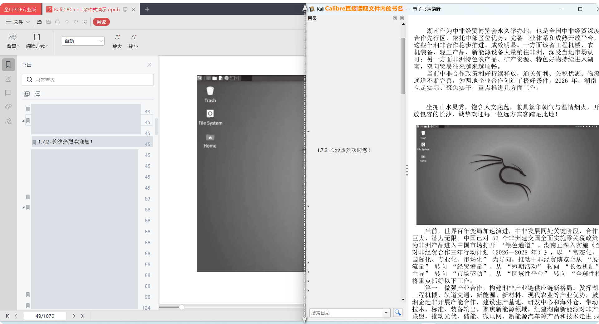
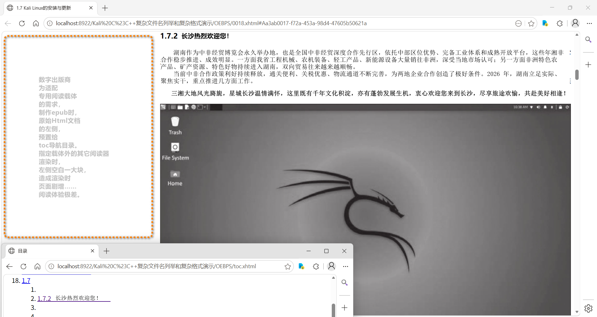

<div align="center">
  


  <!-- GitHub 徽章标记 -->
  <div>
    
    
    
    
    
    
    
    
  </div>
</div>

<div align="center">
<br>

### 匠心凝点滴 屏间阅自由
#### Devotion in details, freedom in reading.

<br>
</div>

<div align="center">

# LocalEpubBatReader
## Windows EPUB 一键转HTML｜Edge原生无损渲染｜离线私有书库｜局域网多设备共享
**基于 BAT 轻量化脚本，离线自建纯净私有阅读书库，无需阅读器、不上云端，Windows 也能流畅运行。**

</div>

---

## 本地 EPUB 转 HTML · 浏览器原生阅读方案
一套面向 Windows 平台的私有化离线电子书库轻量化方案，以 BAT 批处理为核心驱动，实现 EPUB 批量转 HTML、TXT 直接浏览器挂载阅读，依托浏览器原生内核无损渲染，全程本地离线运行，低成本搭建个人纯净阅读书库。

📌 方案定位｜设计版本：1.61｜开源协议：MIT｜适配平台：Windows 10 / 11

## 📖 方案概述
基于本地目录作为书库根节点，兼容自定义分类文件夹、TXT 与 EPUB 混合归档结构。通过 BAT 自动化脚本完成 EPUB 批量解包、转制 HTML、资源规整、全局索引自动生成，构建可浏览器直访、支持多级分类、可局域网多设备共享的轻量化静态书库。

采用隔离式缓存机制，每本 EPUB 独立分配专属目录，拆分存放 HTML、CSS、图片等原生资源；每次重构自动清理冗余缓存，仅做索引纳入、不改动用户原有藏书结构，兼顾自动化整理与原始数据安全。

自动聚合全量书籍与分类目录，生成统一导航首页；智能适配主流 EPUB 标准路径，自动定位章节正文；以纯 HTML 承担书库管理中枢，沿用系统目录权限逻辑，实现轻量化运维与数据完整平衡。

依托系统浏览器原生渲染，完整还原 EPUB 原版排版、样式与图文细节；原生支持 TXT 直接挂载浏览，无需转换、无需第三方阅读器；复用浏览器翻译、朗读、全文检索等能力，打造无广告、无后台驻留的纯净阅读链路。

整套以静态 HTML + BAT 脚本为核心，支持文件夹嵌套分类、自由增删藏书；全程无云端上传、无额外依赖、无注册表写入，开箱即用，后期维护零配置成本。

## 🔍 方案底层原理溯源
最初从手动将 `.epub` 后缀改为 ZIP 解压拆解文件获得设计启发，后续通过读取文件内部 `mimetype` 字段标识 `application/epub+zip`，从官方规范层面佐证了后缀改名解压操作的**标准性、合规性与技术合理性**，也为整套自动化批量解包逻辑奠定了规范依据。

## ✨ 核心亮点
- 🔹 一键自动化：BAT 脚本驱动，批量 EPUB 转 HTML，告别手动繁琐操作
- 🔹 原生无损渲染：Edge 浏览器内核直出，完美还原图文排版
- 🔹 纯离线私有：数据不上云，本地私有化存储，隐私安全有保障
- 🔹 全格式支持：EPUB 解包阅读 + TXT 直接挂载，统一书库管理
- 🔹 极简轻量：无安装、无数据库，电脑流畅运行
- 🔹 局域网共享：一键启动 HTTP 服务，手机/平板/电脑多设备同步阅读

## 🚀 核心功能设计
### 批量 EPUB 解包转 HTML
自动遍历根目录全部 EPUB 资源，全量刷新清空冗余缓存，标准化解包并转制为可浏览器直读 HTML；单书独立隔离目录，统一资源存放规范，避免文件杂乱与缓存堆积。

### 智能索引导航
适配 OEBPS/Text、OEBPS/xhtml、OPS 等主流 EPUB 规范路径，自动跳转章节正文；保留兼容模式直达书籍根目录，覆盖标准与小众非标 EPUB 全场景。

### TXT 原生直接挂载
无需格式转换，浏览器直接读取挂载 TXT 文档，适配任意编码纯文本书籍，与 EPUB 转 HTML 资源共用一套书库分类与导航体系。

### PC 大屏版面适配设计
打破传统阅读器固守的纸质书籍固化版式，跳出刻板的 A4 制式排版思维，摆脱 toc\.ncx 强制排版限制，**直接解析渲染 EPUB 原生 HTML**。针对 PC 宽屏做柔性适配优化，支持自由缩放版面、自定义显示比例，打造更贴合桌面端使用习惯的沉浸式阅读体验。

### 全资源兼容
完整兼容 EPUB 标准体系：XHTML、CSS 样式、OPF 元数据、NCX 目录、内嵌图片与自定义字体；同时原生兼容 TXT 纯文本格式，多格式统一书库管理。

### 轻量化局域网服务
使用 Python 搭建固定端口轻量化 HTTP 内网服务，相比 Nginx 更简洁、零配置、开箱即用；无后台常驻，终端关闭即刻停服，低资源占用不拖累电脑。

### 极简运维架构
遵循「增删即刷新」逻辑，本地增减书籍后重新执行 BAT 脚本即可更新索引导航，浏览器刷新即时生效；无需数据库、无需复杂配置，直接以书库目录结构作为天然索引，运维门槛极低。

## 🧰 运行环境
- 🔹 基础渲染：Windows 10 / 11 自带 Edge 浏览器
- 🔹 共享依赖：Python 3.6 及以上（仅局域网共享需要）
- 🔹 离线使用：仅依赖 BAT 脚本，无任何第三方软件

## 运行效果


## 📂 方案结构
```plaintext
LocalEpubBatReader/
├── images/                          # 方案封面与截图资源
│   ├── banner.jpg                   # 方案头部海报
│   └── screenshot.png               # 脚本运行截图
├── LocalEpubBatReader.bat           # 批处理演进脚本
├── README.md                        # 方案说明文档
├── LICENSE                          # MIT 开源协议
└── reading.html                     # 阅读入口页面
```

## 📝 使用教程
1. **部署**
将.bat脚本文件放入电子书库根目录即可生效。

2. **一键启动**
双击运行 `LocalEpubBatReader.bat`
脚本自动解包 EPUB → 生成reading导航页 → 打开浏览器
点击书籍即可开始阅读

3. **更新书库**
新增/删除书籍后，重新运行脚本即可自动刷新目录。

4. **停止服务**
局域网共享模式下，按 `Ctrl + C` 停止服务，无残留。

5. **卸载清理**
直接删除自动生成的缓存文件夹与 `reading.html`，无注册表残留。

## 📌 版本说明
初始版：轻量快速、稳定兼容、适配所有 EPUB 结构，开箱即用。

进化版：智能适配主流 EPUB 标准路径，自动定位章节正文，用文件目录再现 toc\.ncx 目录。

## ⚠️ 注意事项
- 仅支持无加密的标准 EPUB 文件
- 局域网共享需在同一 WiFi 下，并放行防火墙端口
- 脚本仅做解包与索引，不修改原文件，安全无虞

## ❓ 常见问题 FAQ

- 🔹 Q: 为什么 EPUB 转换后出现乱码或无法正常阅读？
  🔹 A: 首先请确认电子书为无加密的标准 EPUB，本工具不支持加密书籍。另外文件编码、HTTP 服务编码不匹配也会引发乱码，这类问题大多出现在局域网挂载场景，切换为纯本地离线阅读模式即可正常显示。

- 🔹 Q: 局域网共享手机/平板打不开？
  🔹 A: 请确保所有设备在**同一个 WiFi**，并临时关闭电脑防火墙或放行端口。

- 🔹 Q: 新增书籍后如何更新目录？
  🔹 A: 重新运行一次 BAT 脚本即可自动刷新。

- 🔹 Q: 脚本会修改我的原书文件吗？
  🔹 A: 不会，仅做解包、索引、生成 HTML，不改动原文件。
  
- 🔹 Q: 原生阅读体验？
  🔹 A:  用3张模拟截图，简单展示一下更普遍、更舒适的原生阅读体验。

  

  

  
  
  

## 🎯 设计目标
- 🔹 打造本地私有化、全离线闭环个人书库
- 🔹 更自然的贵宾级阅读体验，全程轻量化、无广告、原生阅读
- 🔹 支持 EPUB + TXT 多格式统一管理与归档
- 🔹 实现家庭局域网多设备无缝共享阅读
- 🔹 为 Windows 设备提供高效、干净、长期可用的阅读方案

## 📄 方案信息
- 方案名称：LocalEpubBatReader
- 方案定位：Windows 本地 EPUB 一键转 HTML 阅读工具
- 当前版本：1.61
- 开源协议：MIT
- 运行平台：Windows 10 / 11

## 🤝 免责声明
本作品纯属技术研习创作，致力于分享用原生 HTML 尊享阅览体验的解决方案与开发思路，仅供个人学习研究参考。敬请支持正版图书，维护版权秩序，使用者自行承担一切违规使用带来的相关法律与版权责任。
